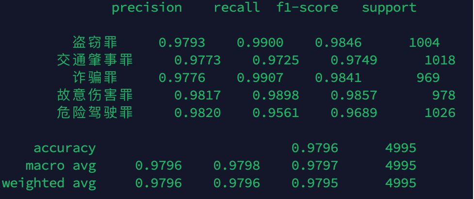
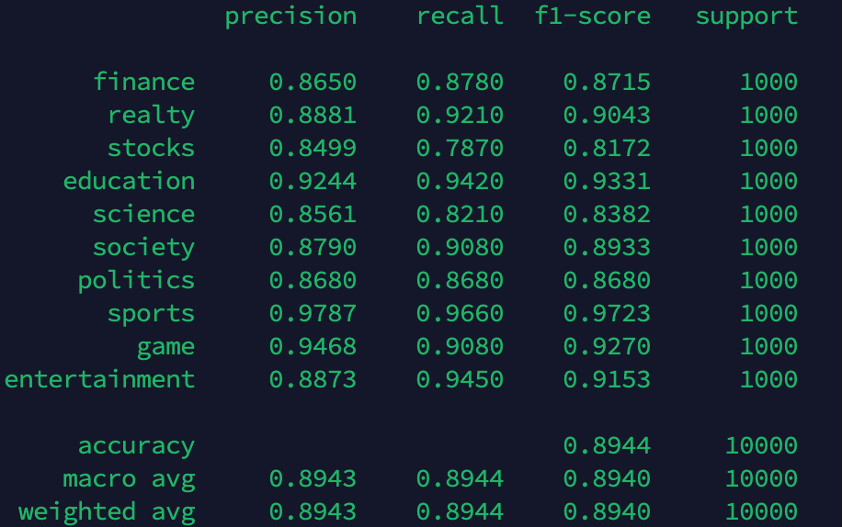
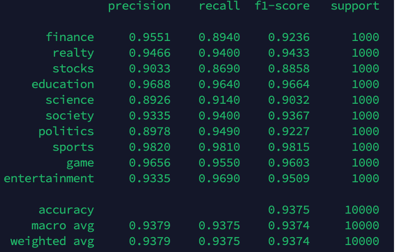
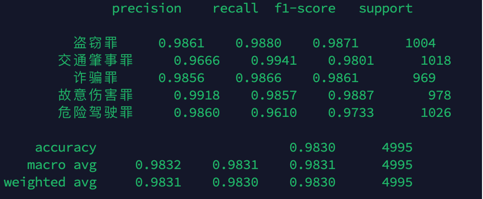
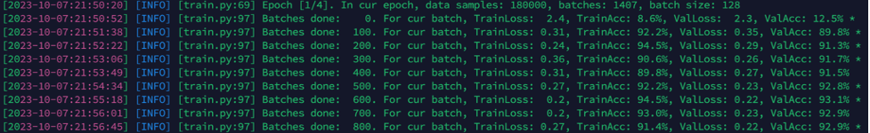
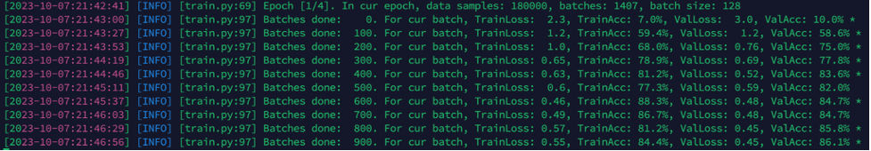

# 教（玩）学（票）：从零写一个Encoder Based Transformer，试试中文文本分类

以教（玩）学（票）目的，从零写一个Encoder Based Transformer，140+行模型代码，试试中文文本分类。

遇到不少同学在搞Transformer Language Model的时候，对底层实现了解不深。这儿写一个教（玩）学（票）性质的Encoder Based Transformer，代码很少，容易跟踪，可以帮助加深理解当前火热的大模型背后的Transformer技术。

因不考虑生产环境中使用，没有特别考虑性能优化。为了验证手写的Encoder Based Transformer的中文分类效果，我准备了两个数据集来训练和测试。另外，我也用同样的数据集测试BertForSequenceClassification (来自huggingface.transformers包的Encoder Based Transformer实现)。对比测试结果表明，咱们教（玩）学（票）性质的Encoder Based Transformer训练速度和测试准确度与"可以应用于生产环境的BertForSequenceClassification"相当。我们模型的代码：[my_transformer.py](my_transformer.py)中的MyEncoderTransformer。

如果你想试试训练和测试一下MyEncoderTransformer，可以根据本文章的后续的提示实践。

## 准备环境
```
1. Linux with NVIDIA GPU（显存 >=16G）
2. 安装python 3.10
3. 安装conda
4. `conda create -n text-classify python=3.10`
5. `conda activate text-classify`
6. `git clone https://github.com/zhangfaen/transformer_text_classification/`
7. `cd transformer_text_classification/`
8. `pip install -r requirements.txt`
```

注：由于github不允许上传大于20MB的文件，因此我压缩了一个数据集的训练数据文件，他是transformer_text_classification/data_judge/train.txt.zip。训练和测试模型之前，应该先解压缩这个文件，解压缩后这个文件路径和名称是transformer_text_classification/data_judge/train.txt

下面先介绍一下附带的2个数据集

## 两个中文数据集

### 新闻标题数据集

数据集在transformer_text_classification/data_news/目录下

20万条新闻标题，一共有10个类别：财经、房产、股票、教育、科技、社会、时政、体育、游戏、娱乐，每类2万条标题数据。数据集按如下划分：
- 训练集：18万条新闻标题，每个类别的标题数为18000
- 验证集：1万条新闻标题，每个类别的标题数为1000
- 测试集：1万条新闻标题，每个类别的标题数为1000

我从[data_news/eval.txt](data_news/eval.txt)中随机选了3条新闻标题，如下
- 阿森纳主帅道歉头一遭 弟子粗野动作温格这次不再近视
- 《教父2》销量差惹EA震怒 新作遭雪藏	
- 美银美林料嘉能今年纯利增逾3倍	

### 法律裁判数据集

数据集在transformer_text_classification/data_judge/目录下

共有约65000条法律裁判文书数据（公开数据），每条裁判文文本讲述的犯罪类型为如下之一：盗窃罪，交通肇事罪，诈骗罪，故意伤害罪，危险驾驶罪

我从[data_judge/eval.txt](data_judge/eval.txt)中随机选了1条新闻标题，如下
- 苏州市吴中区人民检察院指控，被告人矫某于2014年6月1日9时许，在其位于苏州市吴中区木渎镇金山路影视城工地工作时，与张某因干活问题发生争执，遂用钢管击打张某的头部及腰部等部位，致使张某头部等部位受伤。经法医鉴定，被害人张某的损伤属人体轻伤一级。公诉机关为证明上述事实，提供了相关的证据。公诉机关认为，被告人矫某的行为触犯《中华人民共和国刑法》××××的规定，应以××追究其刑事责任。被告人矫某具有自首情节。

## 训练和测试MyEncoderTransformer
```bash
python train.py --data_dir ./data_judge --model_type MyEncoderTransformer
```

NVIDIA A100单卡，大约需要训练15分钟左右，训练结束后，会自动评测。我某次训练的一个结果如下：


```bash
python train.py --data_dir ./data_news --model_type MyEncoderTransformer
```

NVIDIA A100单卡，大约需要训练15分钟左右，训练结束后，会自动评测。我某次训练的一个结果如下：


测试上述两个训练完的模型：
```bash
python demo.py --data_dir ./data_judge --model_type MyEncoderTransformer
python demo.py --data_dir ./data_news --model_type MyEncoderTransformer
```

## 训练和测试BertForSequenceClassification

从 huggingface 官网上下载 bert-base-chinese 模型权重、配置文件和词典到 pretrained_bert 文件夹中，下载地址：https://huggingface.co/bert-base-chinese/tree/main

```bash
python train.py --data_dir ./data_news --pretrained_bert_dir ./pretrained_bert --model_type BertForSequenceClassification
```
NVIDIA A100单卡，大约需要训练15分钟左右，训练结束后，会自动评测。我某次训练的一个结果如下：


```bash
python train.py --data_dir ./data_judge --pretrained_bert_dir ./pretrained_bert --model_type BertForSequenceClassification
```

NVIDIA A100单卡，大约需要训练15分钟左右，训练结束后，会自动评测。我某次训练的一个结果如下：


测试上述两个训练完的模型：
```bash
python demo.py --data_dir ./data_judge --model_type BertForSequenceClassification
python demo.py --data_dir ./data_news --model_type BertForSequenceClassification
```

**注:** 
在news数据集上，BertForSequenceClassification比MyEncoderTransformer测试准确度高，主要原因是我们使用了huggingface上Pretrained的模型权重。如果我们把[train.py](train.py)中如下代码：
```python
        model = BertForSequenceClassification.from_pretrained(
            os.path.join(args.pretrained_bert_dir, "pytorch_model.bin"),
            config=bert_config
        ) # type: ignore
```
替换为
```python
        model = BertForSequenceClassification(bert_config) # type: ignore
```
也就是说我们用一个没有预训练过的BertForSequenceClassification，开始训练，那么它的准确度和MyEncoderTransformer相当。
可以参考如下两张训练日志
bert-news-train-from-pretrained-model:


bert-news-train-from-scratch:


